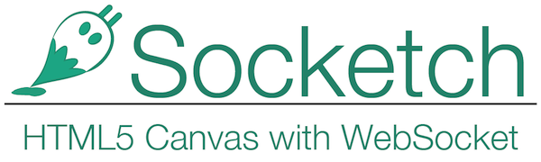

socketch
========
Socketch is a web application using html5 canvas with websocket.

1.  Server side programming language is Python, with Tornado Framework.
2.  Bootstrap 3.0

#Product Design

##Logo

##Application

